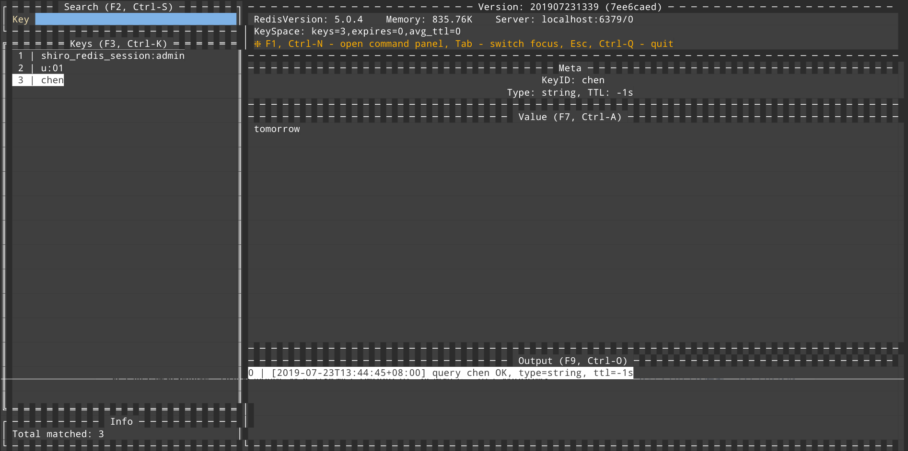

# redis-Tui

A Redis Text-based UI client in CLI, fork from https://github.com/mylxsw/redis-tui




## Plus

- Use ctrl+b to refresh the redis key list.

## bugs known
- Because tcell library which redis-Tui depends on does not support cygwin/msys,so you can't run it in **cmder**(a portable console emulator for Windows) and so on,but you can run it on Win's built-in cmd or powershell.

- This tool doesn't support ssh connection，because I think it's unnecessary. If you wanna connect a redis server behind a online production machine，you can use ssh proxy ,for example:

  ```shell
  #run at localhost 
  ssh -CqTnN -L 0.0.0.0:6379:remoteIp:6379 remoteUser@remoteIp -p remoteSSHPort
  #connect redis local
  localhost:6379
  ```
- Sometimes,the application panics when resize the windows and the windows contains emoji or grapheme cluster. 
  